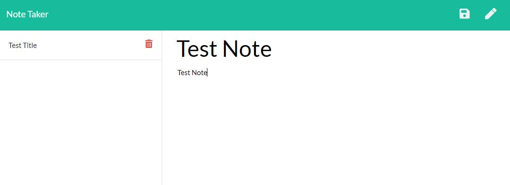
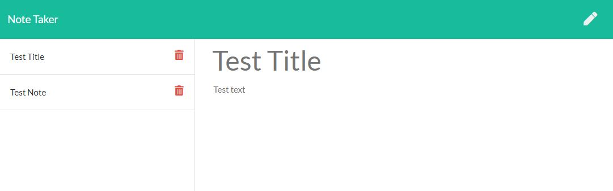
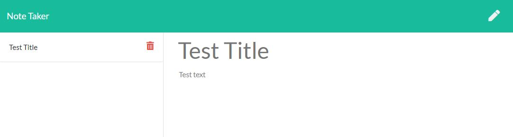

# Note-Taker
##Unit 11 Assignment

This application can be used to write, save, and delete notes. This application uses express backend and it also saves and retrieve note data from a JSON file.

## Business Context

For users that need to keep track of a lot of information, it's easy to forget or be unable to recall something important. Being able to take persistent notes allows users to have written information available when needed.

 * The application will allow users to create and save notes.

 * Application should allow users to view previously saved notes.

 * Application should allow users to delete previously saved notes.

##Links

